<!-- Improved compatibility of back to top link: See: https://github.com/othneildrew/Best-README-Template/pull/73 -->

<!--
*** Thanks for checking out the Best-README-Template. If you have a suggestion
*** that would make this better, please fork the repo and create a pull request
*** or simply open an issue with the tag "enhancement".
*** Don't forget to give the project a star!
*** Thanks again! Now go create something AMAZING! :D
-->

# Village Sports

<!-- TABLE OF CONTENTS -->

  
Table of Contents

  <ol>
    <li>
      <a href="#about-the-project">About The Project</a>
      <ul>
        <li><a href="#built-with">Built With</a></li>
      </ul>
    </li>
    <li>
      <a href="#app-details">App Details</a>
      <ul>
        <li><a href="#log-in">Log In</a></li>
        <li><a href="#home">Home</a></li>
        <li><a href="#discover-and-map">Discover & Map</a></li>
        <li><a href="#chat">Chat</a></li>
        <li><a href="#league">League</a></li>
        <li><a href="#profile">Profile</a></li>
        <li><a href="#wishlist">WishList</a></li>
        <li><a href="#database-and-api">Database & API</a></li>
      </ul>
    </li>
    <li><a href="#roadmap">Roadmap</a></li>
    <li><a href="#team">Team</a></li>
  </ol>

<!-- ABOUT THE PROJECT -->
## About The Project

**VillageSports** is an mobile application to foster community particiption in sports, games and etc. This application serves as a place to congregate leagues and clubs.
* In the application, users can find the leagues information such as incoming events and announcements for the leagues they registered in.
* Users have the ability to explore local leagues based on their interest and geo-location
* Users are able to see detailed information about leagues such as location, hours and contacts to help users determine if they would like to participate in the leagues (with options to save the leagues and review later)
* Once users joined the leagues, the users would be able to chat with other people in the leagues

(<a href="#readme-top">back to top</a>)

### Built With

* ![React-Native]
* ![Expo]
* ![React.js]
* ![CSS]
* ![Firebase]
* ![Google-map]

(<a href="#readme-top">back to top</a>)

<!-- APP Details -->
## App Details

**VillageSports** consists of 8 core components that are outlined below:
* **Log In**: Allows users to sign up/login into the mobile application
* **Home**: Provides users with registered leagues information such as incoming events and important announcements
* **Discover & Map**: Enable users to explore local leagues based on users interests and geo-locations
* **Chat**: Enable users to send text messages with other paripicants in the leagues
* **League**: Contains detailed league information such as name, address, contact, location and etc
* **Profile**: Contains users information such as name, profile pictures, interests and etc
* **WishList**: Save a list of leagues that users would like to review later
* **Database & API**: The backend system to enable above components functionalities

Please note below sub-sections for futher details of each indiviual components

### Log In
The component contains two sub-components: *1. Log in* *2. Sign up*.

  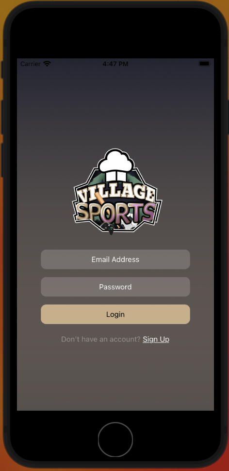
  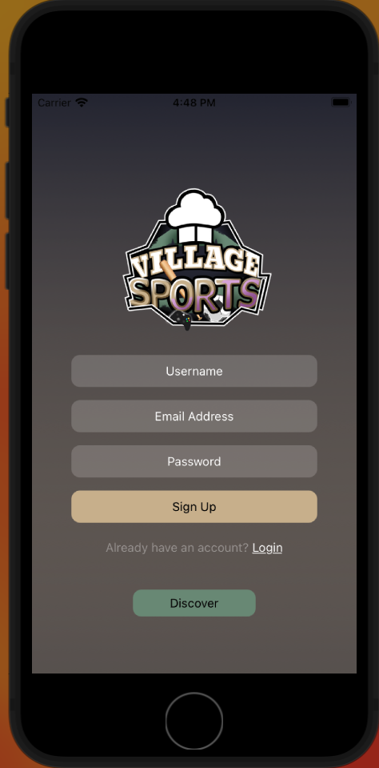

### Home

  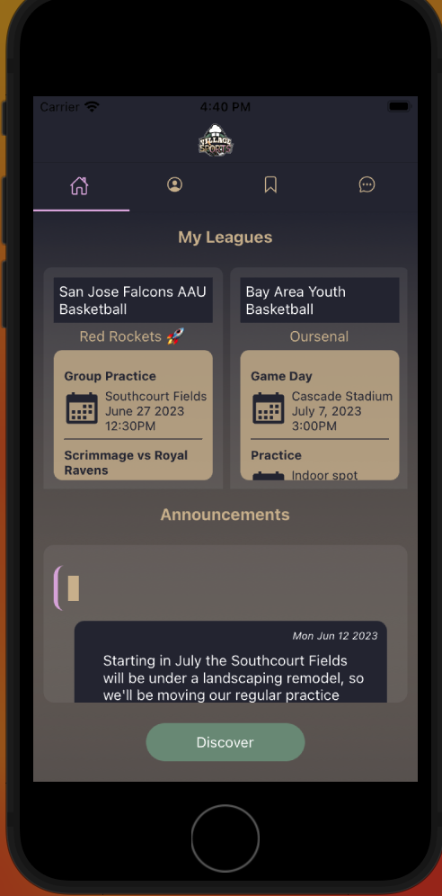

### Discover and Map

**Discover** contains two sub-components: *1. Discover* *2. Recommend* where *Discover* allows users to select their interests and *Recommend* would generate a list of recommended leagues based on users' interests and geo-locations

  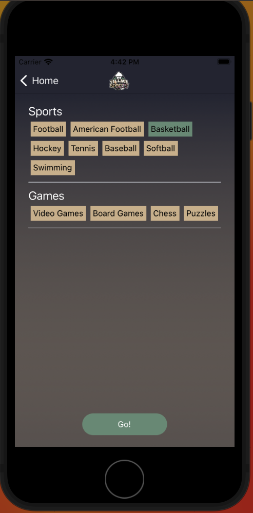
  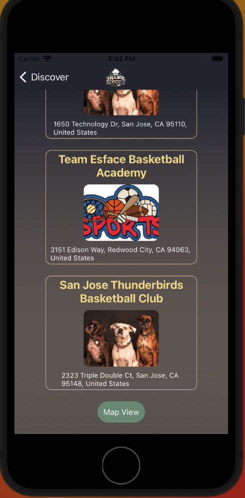

**Map** would display the recommended leagues as markers on the map. When users move the map, users can search nearby leagues based on the new location

  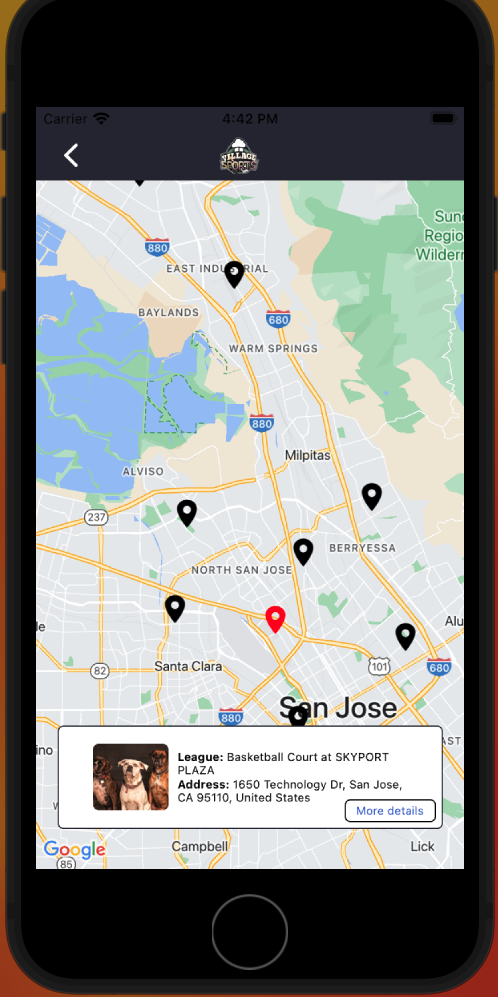
  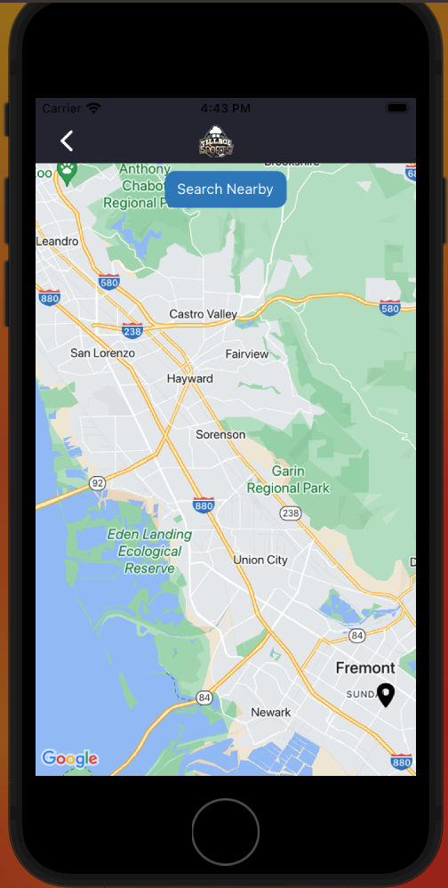

### Chat
**Chat** allows users to receive/send text messages within all people in a league

  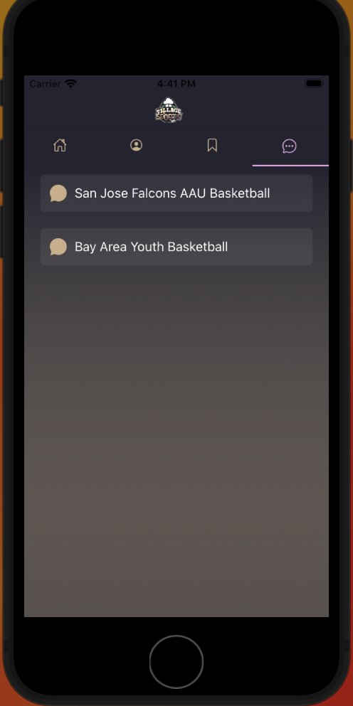
  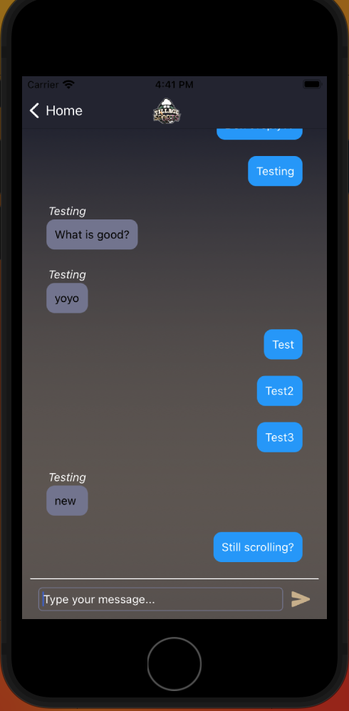

### League
**League** contains detailed league information with the buttons to save the league to wishlist and go to the chat of the league (when applicable)

  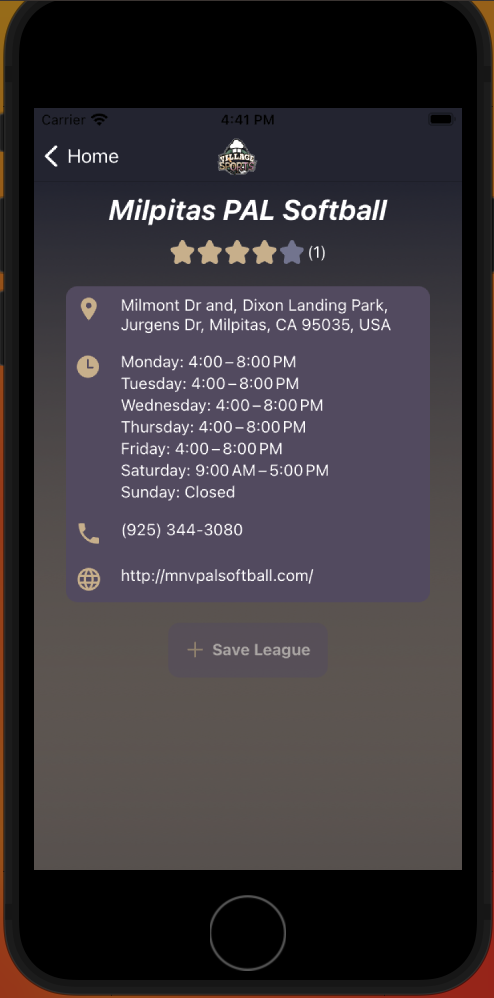

### Profile

  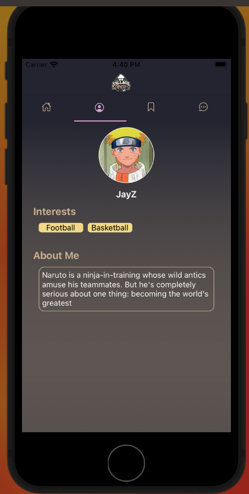

### WishList

  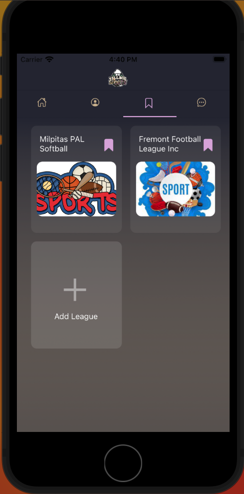

### Database and API

(<a href="#readme-top">back to top</a>)

<!-- ROADMAP -->
## Roadmap

- [ ] Find alternative API that has more detailed leagues information including teams and events
- [ ] Enable delete operations (e.g remove wishlist, remove interests from the user profile)
- [ ] Create a seperate flow for signup users
    - [ ] User info form
    - [ ] Discover local leagues post signup

(<a href="#readme-top">back to top</a>)

<!-- CONTACT -->
## Team
Below are the team members and the corresponding components that the team member is responsible for.

Login [(Fox Seo)](https://www.linkedin.com/in/jinmyeongseo/)\
Home [(Rachel Miller)](https://www.linkedin.com/in/rachel-miller-mlr/)\
Profile [(Benji Cardon)](https://www.linkedin.com/in/benjamin-cardon/)\
Discover [(Naru Sadakuni)](https://www.linkedin.com/in/narusadakuni/)\
Map, WishList and Post enhancement [(Jay Zhang)](https://www.linkedin.com/in/jay-zhang1995/)\
League [(Sahid Adin)](https://www.linkedin.com/in/sahidadin/)\
Chat [(Michael Del Pape)](https://www.linkedin.com/in/delpapemichael/)

**Note**: Post enhancement includes *1. building database to support the application* *2. using Google Map API instead of mock data* *3. reformatting the profile, chat, discover components*

(<a href="#readme-top">back to top</a>)

<!-- MARKDOWN LINKS & IMAGES -->
<!-- https://www.markdownguide.org/basic-syntax/#reference-style-links -->
[React-Native]: https://img.shields.io/badge/React_Native-20232A?style=for-the-badge&logo=react&logoColor=61DAFB
[React.js]: https://img.shields.io/badge/React-20232A?style=for-the-badge&logo=react&logoColor=61DAFB
[Expo]: https://img.shields.io/badge/Expo-1B1F23?style=for-the-badge&logo=expo&logoColor=white
[Firebase]: https://img.shields.io/badge/firebase-ffca28?style=for-the-badge&logo=firebase&logoColor=black
[CSS]: https://img.shields.io/badge/CSS3-1572B6?style=for-the-badge&logo=css3&logoColor=white
[Google-map]: https://img.shields.io/badge/Google%20Maps-4285F4.svg?style=for-the-badge&logo=Google-Maps&logoColor=white
[Log-in]: assets/Login.png
